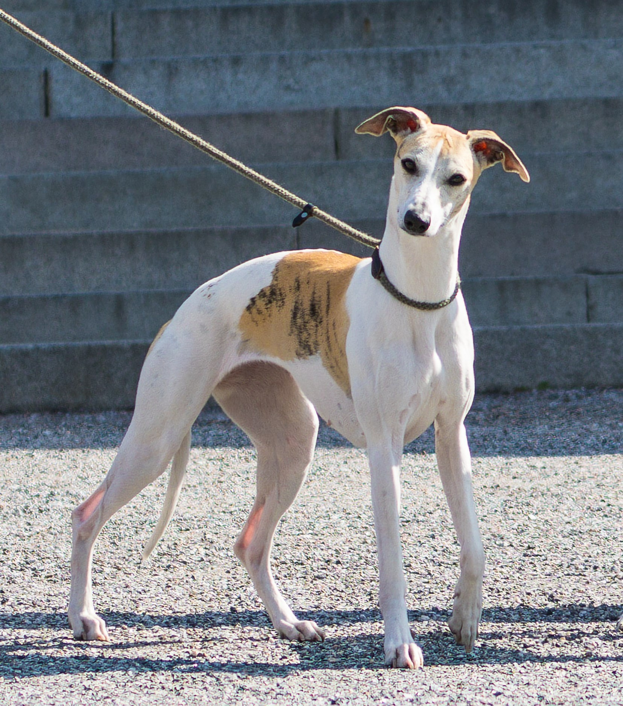

 Macawe

### [Macawe](http://www.macawe.com/)

Liten uppfödning av Whippet

* [Home](https://www.macawe.com/)
* [Valpar 2023-2024](valpar-2024.html)
* [Planerat](valpar-2026.html)
* [Tidigare valpkullar](#previous_litters)
* [Om Macawe](about.html)

### Tidigare kullar 

Första kullen föddes 1990

##### [2023 Metro](valpar-2023.html)

2+2 födda 2023-07-26

e. Libriums Metropolitan  
u. Macawe Magnetite

 

##### [2023 One](valpar-2023.html)

7+1 födda 2023-04-12

e. LCCH Skarnbro's One Hit  
u. Macawe Magnificent

 

##### [2022 Wild](valpar-2022.html)

6+4 födda 2022-05-04

e. CH Chase Me Ace Of Spades  
u. Macawe Magnificent

 

##### [2021 Mega](valpar-2021.html)

3+3 födda 2021-07-04 (fryst sperma, A.I.)

e. Sporting Fields Believe it or Not at Harmony (USA)  
u. Macawe Mandolin

 

##### [2021 Marie](valpar-2021.html)

0+6 födda 2021-07-02

e. CH Allettes Irish Mist Drambuie  
u. Macawe Muscatel

 

##### [2019 Magnetism](valpar-2019.html)

1+4 födda 2019-02-15 (fryst sperma, A.I.)

e. Am Grand Ch Harmony’s Van Gogh (USA)  
u. Macawe Must-Have (cert, BIR-vinnare)

 

##### [2018 Man](valpar-2018.html)

3+2 födda 2018-07-18

e. Macawe Wernher  
u. Macawe Muscatel

 

##### [2014 Madeleine](https://whippet.breedarchive.com/animal/view/macawe-madeleine-0aef8af2-8bfd-4981-a7ea-867558d00cfc)

0+1 födda 2014-09-24 (fryst sperma, A.I.)

e. Am CH Harmony’s Andauer Lover Come Back ROM (USA)  
u. Macawe Mulan 

 

##### [2012 Mus](https://whippet.breedarchive.com/animal/view/macawe-must-have-d9cec8e2-029c-4ff9-bc6f-c43311f2b3ac)

4+3 födda 2012-11-21

e. GB CH, US CH, CA CH, NO CH, DK CH Airescot Ruby Rascal  
u. Macawe Moonwalk

 

##### [2009 Mul](https://whippet.breedarchive.com/animal/view/macawe-mulan-5241db03-ff18-4749-8a94-26138af390df)

2+2 födda 2009-11-19 

e. Macawe Watson de la Mezzotinto  
u. Macawe Moonwalk

 

##### [2006 Mi](https://whippet.breedarchive.com/animal/view/macawe-miah-bc03f336-ab29-41fd-93d9-50ec37608cd5)

1+1 födda 2006-11-09, oplanerad.

e. Macawe Wernher  
u. Macawe Mezzo-Soprano

 

##### [2006 Moon](https://whippet.breedarchive.com/animal/view/macawe-moonwalk-0a61b908-5a9c-4b6c-a637-7f05eeb03192)

1+6 födda 2006-05-10

e. Sportingfield B&W Airescot (import USA)  
u. Macawe Minerva

 

##### [2005 Wer](https://whippet.breedarchive.com/animal/view/macawe-wernher-fbd1b7df-bb09-47ef-bc93-5874d969ea60)

2+4 födda 2005-10-09

e. Macawe Mindset  
u. Macawe Waris à Mezzotinto

 

##### [2005 P](https://whippet.breedarchive.com/animal/view/macawe-pelagius-cuts-a-dash-29dd2163-d97c-4dbe-b26d-058dd825e367)

5+0 födda 2005-04-08

e. Wychglade Pied Wagtail (import Storbritannien)  
u. Macawe Mezzo-Soprano

 

##### [2004 Min](https://whippet.breedarchive.com/animal/view/macawe-mindset-4acbd18a-ad92-4159-b04d-70abd4779c33)

3+4 födda 2004-02-29

e. WW 2001, C.I.B., NL CH, DE CH (VDH), WCD CH Taraly Malcolm X (Frankrike)  
u. Macawe Mezzo-Soprano

 

##### [2003 W](https://whippet.breedarchive.com/animal/view/macawe-waris-a-mezzotinto-74e192e1-8613-4e4d-a25b-f7cc9c9c1e52)

1+2 födda 2003-03-23

e. WW 2001, C.I.B., NL CH, DE CH (VDH), WCD CH Taraly Malcolm X (Frankrike)  
u. Wychglade Willow Warbler (import Storbritannien)

[Back to top](#top)

©2026